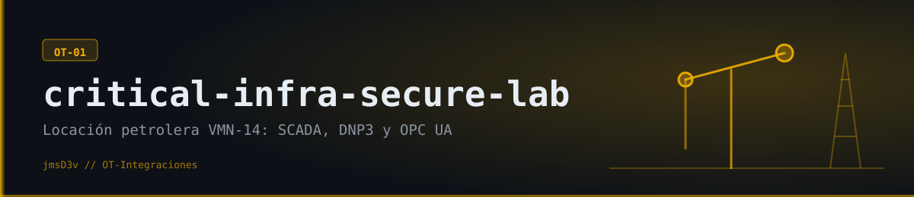
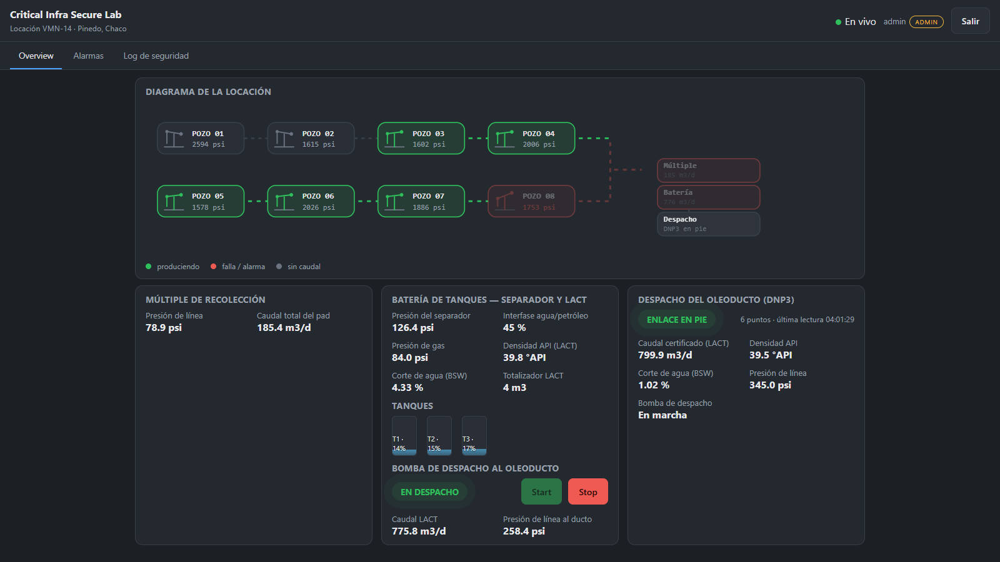
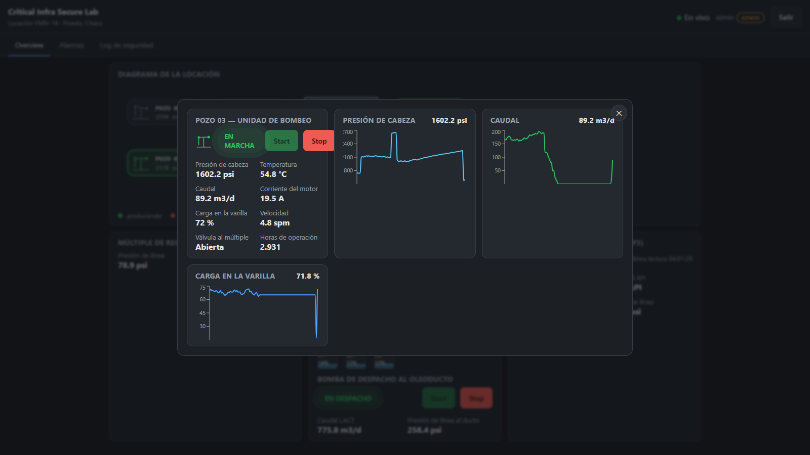
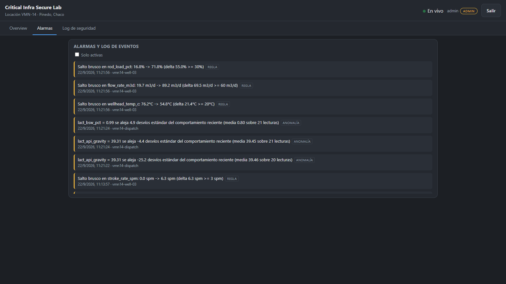
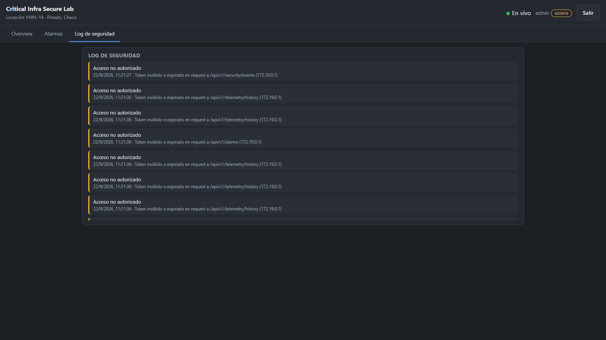
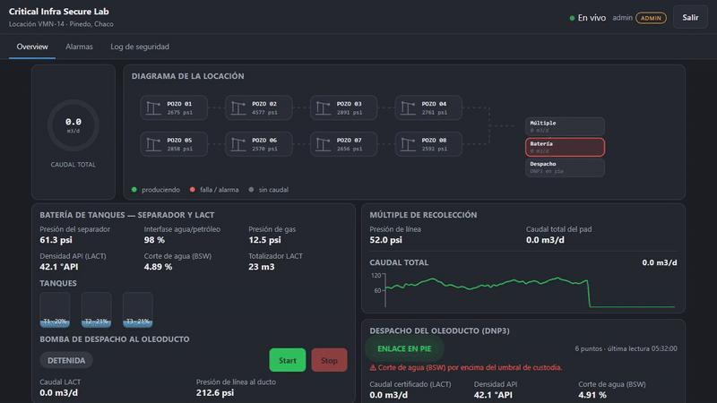
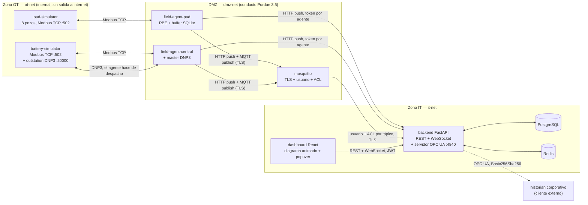

# Critical Infra Secure Lab

**Mini-SCADA de laboratorio** para una locación petrolera no convencional (**VMN-14**, inspirada en la puesta en marcha real de un parque en Argentina): agentes de campo que leen los equipos en tiempo real, un gateway FastAPI que los recibe y un dashboard con un diagrama animado de toda la locación. Los equipos son simulados (8 pozos con bombeo mecánico, múltiple de recolección, batería de tanques con separador y unidad LACT), pero **los protocolos son reales**: Modbus TCP dentro de la locación, MQTT sobre TLS como overlay IIoT, DNP3 hacia el despacho del oleoducto y OPC UA como puente hacia un historian corporativo. Primer proyecto de la serie **OT-Integraciones** de [@jmsD3v](https://github.com/jmsD3v).

  

---

## Qué problema real resuelve

Una locación no convencional genera telemetría continua (presión de
cabeza, temperatura, caudal, carga en la varilla, nivel de tanque,
densidad y corte de agua del crudo) desde equipos de campo dispersos.
Esa telemetría tiene que llegar a un sistema central para monitoreo y
control — el problema real de siempre en oil & gas: cómo integrar una
red de control (OT) con los sistemas de negocio (IT) **sin** que la
superficie de ataque de uno se convierta en la del otro, y cómo hacerlo
con los protocolos que se usan de verdad en esta industria, no con uno
genérico.

Este laboratorio construye esa integración de punta a punta y la trata
como lo que es: un problema de seguridad tanto como uno de ingeniería de
datos. No es una demo de "conectar todo a todo" — es una demo de **cómo
segmentar, autenticar y auditar** esa integración, con la jerarquía real
de una locación (no un equipo suelto) y los protocolos que corresponde
usar en cada tramo.

## Qué es (y qué no es)

Es un **mini-SCADA de laboratorio**: hace lo que hace un SCADA —
adquisición, pantallas, alarmas, historial y control — para una
locación, con equipos simulados. **No es** un SCADA comercial: no se
probó con equipos reales, tiene una sola instancia (sin alta
disponibilidad) y no cuenta con certificaciones como IEC 62443.

| Función de un SCADA | Cómo está resuelta acá |
|---|---|
| Adquisición de datos | Agentes de campo por Modbus TCP; reporte por excepción con bandas muertas y buffer offline (SQLite) |
| Pantallas (HMI) | Dashboard React con un diagrama SVG animado de toda la locación, drill-down a cada pozo por popover, actualización en vivo por WebSocket |
| Alarmas | Umbral alto/bajo, salto brusco, cambio de estado inesperado (por dispositivo, no un campo hardcodeado) + detección de anomalías por z-score |
| Historial | Lecturas crudas con payload genérico por tipo de dispositivo (pozo, múltiple, batería, despacho) |
| Control | Comandos *start/stop* por pozo y para la bomba de despacho, modelo *pull* (el agente los va a buscar, nunca hay conexión entrante hacia OT) |
| Integración con IT/historian | Servidor **OPC UA** de solo lectura, cifrado y autenticado — el puente estándar hacia un historian corporativo (PI, AVEVA) |
| Seguridad | Redes segmentadas (OT / DMZ / IT), permisos por rol, token propio por agente, MQTT con TLS 1.3 + ACL por tópico, auditoría de eventos de seguridad |

**Qué demuestra:** el recorrido completo de un sistema industrial en
tiempo real — equipo → agente de campo → gateway → base de datos →
dashboard por WebSocket —, con **cuatro protocolos de campo reales**
(Modbus TCP, MQTT, DNP3, OPC UA), decisiones de diseño documentadas (19
ADRs), 66 tests, integración continua e imágenes multi-arquitectura.

## Cómo se ve

Vista de escritorio del dashboard real corriendo contra el stack
completo (también es responsivo: la grilla de pozos reemplaza al
diagrama en pantallas chicas).

**La locación completa, de un vistazo.** Diagrama unifilar animado: los
8 pozos con su unidad de bombeo (se la ve moverse), el múltiple, la
batería y el despacho, con líneas de flujo que se activan según el
estado real de cada equipo.

  

**Un pozo informa solo lo suyo.** Al hacer clic en un pozo (en el
diagrama o en la grilla táctil de celular) se abre su detalle flotante:
presión, temperatura, caudal, carga en la varilla, velocidad, y control
*start/stop* para el rol admin.

  

**Alarmas y log de seguridad.** Alarmas por regla y por anomalía
estadística, con el dispositivo de origen; y el log de accesos e
intentos no autorizados, auditado aparte.

  
  

## En movimiento

Un recorrido por el dashboard: la locación completa, un pozo en marcha, la batería y el despacho.

  

[Ver en mejor calidad (MP4)](docs/demo.mp4)

## Características

- **Jerarquía real de una locación** — 8 pozos con unidad de bombeo
  mecánico, múltiple de recolección, batería de tanques (separador
  trifásico + 3 tanques + unidad LACT de medición de custodia) y bomba
  de despacho, como procesos separados con su propio mapa Modbus (ver
  [ADR 0015](docs/adr/0015-multi-well-pad-and-central-battery-hierarchy.md)).
- **Cuatro protocolos reales, cada uno donde corresponde** — Modbus TCP
  dentro de la locación; MQTT sobre TLS 1.3 como overlay IIoT; **DNP3**
  (implementación propia, sin dependencias, CRC verificado contra el
  valor de catálogo estándar) hacia el despacho del oleoducto, con su
  propio enlace que se cae de forma realista; **OPC UA** (`asyncua`,
  Basic256Sha256, nunca anónimo) como puente hacia un historian
  corporativo.
- **Diagrama animado, no una tabla de números** — líneas de flujo que se
  activan según el estado real de cada equipo, y cada pozo con su propia
  unidad de bombeo animada (sube y baja de verdad, no solo rota).
- **Motor de alarmas genérico** — cualquier campo de estado de cualquier
  tipo de dispositivo se vigila por separado, configurable por YAML sin
  tocar código.
- **Seguridad por diseño** — tres redes segmentadas (OT / DMZ / IT),
  contenedores con `cap_drop` y sistema de archivos de solo lectura,
  token propio por agente, Mosquitto con usuario y ACL por agente y TLS
  1.3, RBAC (admin / operador), servidor OPC UA cifrado y autenticado.

## Arquitectura

`field-agent-pad` y `field-agent-central` son los únicos contenedores
con una pata en `ot-net` y otra en `dmz-net`; `backend` es el único que
cruza `dmz-net` ↔ `it-net`. `pad-simulator`, `battery-simulator`,
`postgres` y `redis` no tienen ninguna ruta de red hacia el resto — ver
[`docs/adr/0004`](docs/adr/0004-purdue-model-docker-networks.md) y el
detalle completo de controles en [`docs/SECURITY.md`](docs/SECURITY.md).

## Stack

| Capa | Tecnología |
|---|---|
| Field agent | Python 3.12, `pymodbus` (simuladores de pad y batería + agentes), DNP3 propio sin dependencias, SQLite (buffer offline), `paho-mqtt` con TLS |
| Backend / Gateway | Python 3.12, FastAPI, SQLAlchemy 2.0, PostgreSQL, Redis, WebSocket, JWT (`python-jose`), `bcrypt`, servidor OPC UA (`asyncua`) |
| Dashboard | React 18 + TypeScript, Vite, diagrama SVG animado, `recharts` |
| Infra | Docker Compose (9 servicios), tres redes segmentadas por zona Purdue, Mosquitto con TLS, imágenes multi-arquitectura (amd64 + arm64) |

## Decisiones técnicas (ADRs)

Cada decisión no obvia queda documentada con su contexto, la decisión en
sí y las consecuencias aceptadas — en [`docs/adr/`](docs/adr/):

| ADR | Decisión |
|---|---|
| [0001](docs/adr/0001-modbus-tcp-as-primary-protocol.md) | Modbus TCP como protocolo primario |
| [0002](docs/adr/0002-report-by-exception.md) | Reporte por excepción (deadband + heartbeat) |
| [0003](docs/adr/0003-sqlite-local-buffer-for-resilience.md) | Buffer local en SQLite para resiliencia offline |
| [0004](docs/adr/0004-purdue-model-docker-networks.md) | Modelo Purdue implementado con redes Docker reales |
| [0005](docs/adr/0005-postgresql-for-persistence.md) | PostgreSQL sin Alembic (`create_all` alcanza para este alcance) |
| [0006](docs/adr/0006-redis-as-queue-and-rate-limiter.md) | Redis como cola de ingesta MQTT y limitador de login |
| [0007](docs/adr/0007-jwt-rbac.md) | JWT + RBAC de dos roles, `bcrypt` directo (no `passlib`) |
| [0008](docs/adr/0008-rule-engine-and-anomaly-detector-as-separate-layers.md) | Motor de reglas y detector de anomalías como capas separadas |
| [0009](docs/adr/0009-device-ingest-token-and-pull-commands.md) | Token de dispositivo + comandos de actuador en modelo *pull* |
| [0010](docs/adr/0010-mqtt-as-secondary-protocol.md) | MQTT como protocolo secundario funcional |
| [0011](docs/adr/0011-dashboard-stack-and-live-updates.md) | Vite + React + TS, WebSocket con semilla REST |
| [0012](docs/adr/0012-container-hardening.md) | `cap_drop: ALL` por defecto, sumar solo lo indispensable |
| [0013](docs/adr/0013-incident-scenarios-as-standalone-scripts.md) | Escenarios de incidente como scripts contra el stack real |
| [0014](docs/adr/0014-basic-ci-scope.md) | Alcance de la CI básica |
| [0015](docs/adr/0015-multi-well-pad-and-central-battery-hierarchy.md) | Locación multi-pozo con batería central, no un pozo suelto |
| [0016](docs/adr/0016-dnp3-as-custody-and-dispatch-protocol.md) | DNP3 propio hacia el despacho del oleoducto |
| [0017](docs/adr/0017-mqtt-tls.md) | MQTT con TLS por defecto |
| [0018](docs/adr/0018-private-license-and-showcase-repo.md) | Código privado, repo showcase público |
| [0019](docs/adr/0019-opc-ua-as-historian-bridge.md) | OPC UA como puente hacia un historian corporativo |

## Bugs reales encontrados en el camino

Este laboratorio se construyó corriendo cada pieza de verdad (venvs
reales, servidores Modbus/DNP3/OPC UA reales, `docker compose up` real,
un cliente OPC UA real, un navegador real), no solo escribiendo código y
asumiendo que funciona. Eso encontró bugs reales:

- **pymodbus 3.8+ deprecó la API clásica del datastore** — se resolvió
  fijando `pymodbus<3.8` ([ADR 0001](docs/adr/0001-modbus-tcp-as-primary-protocol.md)).
- **`passlib` 1.7.4 rompe contra `bcrypt`>=4.1** — se resolvió usando
  `bcrypt` directo ([ADR 0007](docs/adr/0007-jwt-rbac.md)).
- **`cap_drop: ALL` rompe el bind a puertos privilegiados** y también
  rompe `postgres`/`redis`/`mosquitto`/`dashboard` (entrypoints
  oficiales que necesitan `chown`/`setuid` como root al arrancar) — ver
  [ADR 0012](docs/adr/0012-container-hardening.md).
- **El CRC de cabecera de DNP3 se recalculaba sobre los bytes
  equivocados** al decodificar (la codificación cubre los 8 bytes de
  cabecera completos; la decodificación solo recalculaba sobre 5) —
  encontrado con un test de round-trip por socket real, verificado
  además contra el valor de catálogo estándar de CRC-16/DNP
  (`"123456789"` → `0xEA82`).
- **El master DNP3 mezclaba puntos binarios y analógicos con el mismo
  índice** en un solo diccionario — un Analog Input y un Binary Input
  pueden compartir índice en DNP3 real (espacios independientes), y el
  segundo pisaba al primero. Se corrigió con claves `(kind, index)`.
- **`asyncua` decide PEM vs. DER por la extensión del archivo, no por el
  contenido**: la clave privada se escribía en PEM con extensión `.key`
  y el servidor tiraba `ValueError: Could not deserialize key data` al
  arrancar — se resolvió nombrando el archivo `.pem`.
- **Git Bash en Windows rompe el bind mount de `docker run -v`** por el
  path-mangling de MSYS (`can't cd to /certs`) — se resolvió con
  `MSYS_NO_PATHCONV=1` en el script de certificados.
- **El CI nunca se había disparado**: el workflow escuchaba
  `branches: [main]` pero el repo usaba `master` — un push directo nunca
  lo activaba, solo los pull requests (que este proyecto no usa).
- **pnpm 9 (fijado en el CI) no reconoce `allowBuilds`** en
  `pnpm-workspace.yaml` (esa clave la lee pnpm ≥12) y fallaba con
  `packages field missing or empty` antes de instalar nada.
- **Las líneas del diagrama pasaban por detrás de los nodos**: al ser el
  fondo de cada nodo semi-transparente, una sola línea continua por fila
  se veía cruzando el ícono del pozo. Se resolvió segmentando la línea
  para que ocupe solo los huecos entre nodos, nunca su interior.
- **La primera animación del pumpjack rotaba todo el brazo alrededor de
  un pivote** y la varilla pulida quedaba fija — al girar, el cabezal se
  despegaba visualmente de la varilla. Se resolvió animando cada punto
  por separado y en fase (cabezal y varilla juntos; contrapeso en fase
  exactamente opuesta), verificado leyendo los valores animados por
  código en dos instantes distintos.

## Roadmap

- **TLS interno para Modbus y DNP3** — hoy van en claro dentro de
  `ot-net` (red Docker `internal: true`, nunca sale del host).
- **DNP3 Secure Authentication** (IEEE 1815) en vez de un enlace sin
  autenticación a nivel de aplicación.
- **mTLS por dispositivo** en vez del `X-Device-Token` estático actual.
- **Certificado de servidor OPC UA persistente** firmado por una CA
  propia, en vez de autofirmado y regenerado en cada arranque.
- **Migraciones versionadas con Alembic** en vez de `create_all()`.
- **Persistencia del estado del detector de anomalías** entre reinicios
  del backend (hoy vive en memoria).
- **Un banco de pruebas de ciberseguridad OT genérico**, como proyecto
  aparte, que use esta locación como una de sus plantas objetivo.
- **Agente de campo compilado** (por ejemplo en Rust) para un mini-PC
  industrial: ejecutable único, más liviano y sin código fuente a la
  vista.

## Acceso al código

El código es **privado** (todos los derechos reservados). Este repositorio muestra el proyecto: qué hace, cómo está diseñado y cómo se ve funcionando. Si querés verlo corriendo en vivo o hablar del proyecto, escribime.

- GitHub: [@jmsD3v](https://github.com/jmsD3v)
- LinkedIn: [jmsilva83](https://www.linkedin.com/in/jmsilva83)

---

Copyright © 2026 Desarrollado por [@jmsD3v](https://github.com/jmsD3v) — todos los derechos reservados

